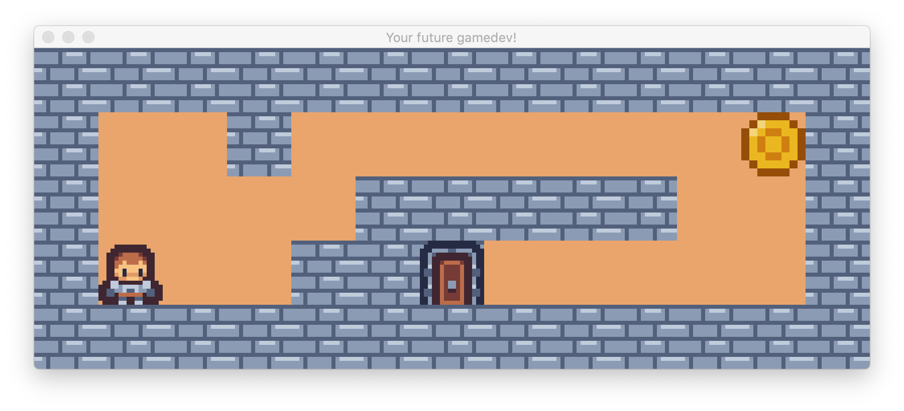

# 🚀 42 So Long

> So_long ist ein spannendes Projekt, bei dem man die Grundlagen der 2D-Spieleentwicklung lernt




## ✨ Das Projekt

Das Ziel ist es, ein kleines 2D-Spiel zu programmieren, in dem man einen Charakter durch ein Labyrinth steuern muss.

### Mandatory
  Folgende Anforderungen müssen erfüllt sein:
  * **Grafik:** Verwendung der [MLX42](https://github.com/codam-coding-college/MLX42) zur Verwaltung von Fenstern basierend auf GLFW und OpenGL.
  * **Map:** Das Spiel lädt eine Map aus einer `.ber`-Datei.
  Diese muss bestimmte Elemente enthalten: einen Startpunkt, ein Ziel, einsammelbare Items und Hindernisse.
  * **Gameplay:** Der Spieler muss alle Items einsammeln und zum Ziel gelangen, um das Spiel zu gewinnen.

## ⚙️ Kompilieren
Klone das Repository und kompiliere das Projekt mit `make`. Die benötigte MLX42 wird automatisch heruntergeladen und hinzugefügt:

```bash
git clone https://github.com/Stemmzi/42_so_long
cd so_long
make
```

## Credits
- Fast alle Texturen: [hier](https://kenney-assets.itch.io/tiny-dungeon)
- Münztextur: [hier](https://melthie.itch.io/mini-dungeon)
- Praktischer Map Maker: [here](https://github.com/nmihaile/slmm)
