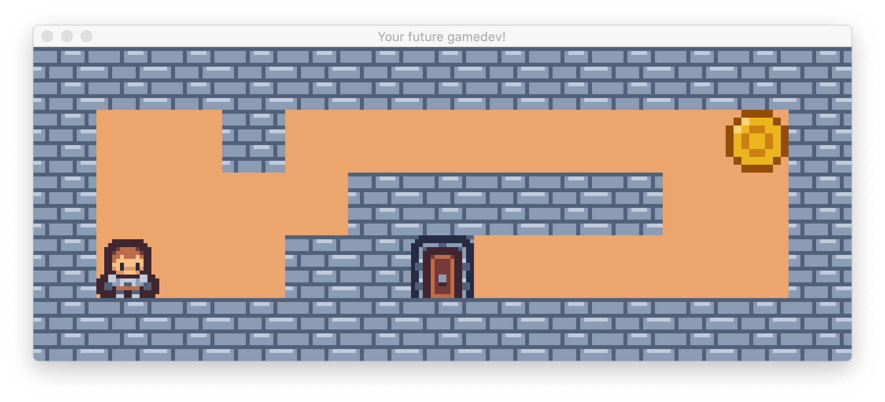

# 42_so_long
This is my solution for the so_long project from 42 school.

## Goal of the project?
- Creating your first small 2D-game.
- You are using a graphics library running on GLFW and OpenGL, the [MLX42](https://github.com/codam-coding-college/MLX42).
- In that game you control a player, to collect all coins and then escape through the exit using the shortest way possible.

## Rating
- I achieved 100/100 points.
- There is one small extra. When all coins are collected. The door opens, giving visual feedback that is possible to finish the game now.

## Credits
- Almost every texture: [here](https://kenney-assets.itch.io/tiny-dungeon).
- Coin texture: [here](https://melthie.itch.io/mini-dungeon).
- Very cool Map Maker: [here](https://github.com/nmihaile/slmm).